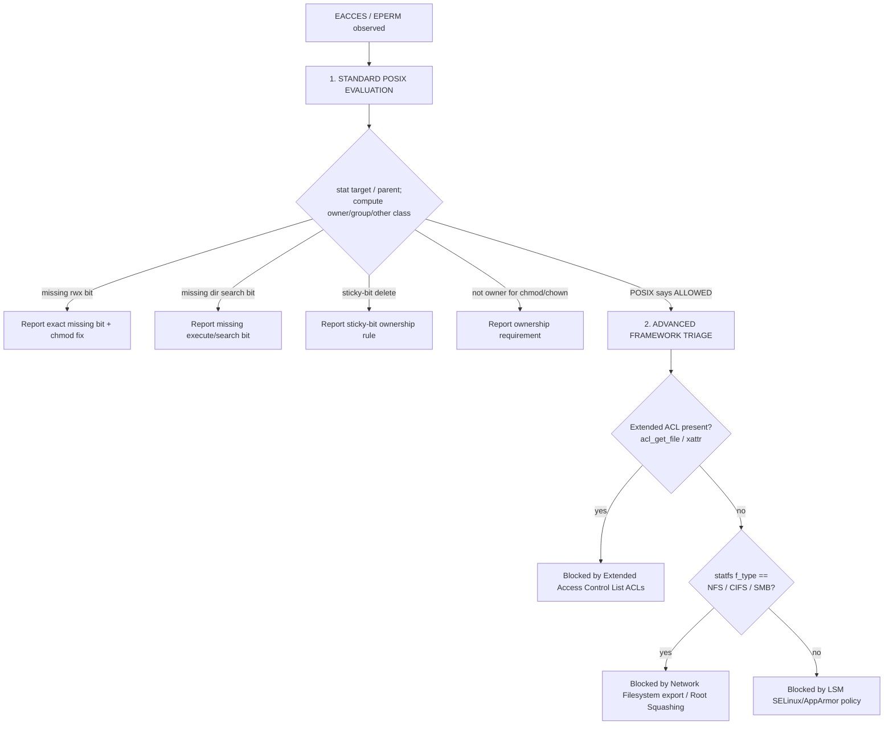

<div align="center">

# 🛡️ why-denied

### Stop guessing. Know *exactly* why your "Permission denied" happened

[](https://github.com/doper1/why-denied/releases)
[](https://github.com/googleapis/release-please)
[](LICENSE)
[](src/why-denied.c)

**`why-denied`** is a tiny helper that runs quietly in the background of your
shell. Whenever a command fails with the dreaded **"Permission denied"**, it
tells you **what actually went wrong** — and gives you the **exact command to
fix it**. No more guessing, no more digging through docs. Your programs keep
working exactly as before; you just get a friendly explanation when something
gets blocked.

</div>

---

## Table of Contents

- [What & Why](#what--why)
- [Quick demo](#quick-demo)
- [Architectural Overview](#architectural-overview)
- [The Triage Decision Tree](#the-triage-decision-tree)
- [POSIX Compliance Rationale](#posix-compliance-rationale)
- [Intercepted Syscalls](#intercepted-syscalls)
- [Installation](#installation)
- [Usage & Sample Output](#usage--sample-output)
- [Building from Source](#building-from-source)
- [Testing](#testing)
- [Packaging](#packaging)
- [Security Considerations](#security-considerations)
- [Performance Notes](#performance-notes)
- [Contributing](#contributing)
- [License](#license)

---

## What & Why

`Permission denied` is one of the least helpful error messages in computing. It
tells you *that* you were blocked, never *why*. Was it the file mode? A parent
directory you can't traverse? A POSIX ACL? An NFS root-squash? SELinux?

`why-denied` answers that question automatically. It hooks the libc wrappers
that can fail with `EACCES`/`EPERM`, and **only** when one of them actually does
(during an interactive session) it runs a careful, read-only investigation and
prints a one-line diagnosis to STDERR:

```text
$ touch /data/report.csv
touch: cannot touch '/data/report.csv': Permission denied
[why-denied] Cannot write into directory '/data': Missing group write permission. Run 'chmod g+w /data'.
```

The original program's behaviour, return value and `errno` are **never**
altered — `why-denied` is a passive observer that whispers the answer.

---

## Quick demo

| You run                       | The kernel says       | `why-denied` adds                                                                                          |
| ----------------------------- | --------------------- | ---------------------------------------------------------------------------------------------------------- |
| `cat /etc/shadow`             | `Permission denied`   | `[why-denied] Cannot READ from '/etc/shadow': Missing other read permission. Run 'chmod o+r /etc/shadow'.` |
| `./deploy.sh`                 | `Permission denied`   | `[why-denied] Cannot EXECUTE '/home/me/deploy.sh': Missing owner execute permission. Run 'chmod u+x ...'.` |
| `rm /tmp/someone-elses-file`  | `Operation not permitted` | `[why-denied] Cannot delete '/tmp/...': Directory '/tmp' has the sticky bit set; only the file's owner ...` |
| `echo x > /srv/share/file`    | `Permission denied`   | `[why-denied] Blocked by Network Filesystem (NFS) export rules or Root Squashing.`                         |

---

## Architectural Overview

`why-denied` is a shared object injected with `LD_PRELOAD`. Because preloaded
symbols take precedence over libc's, our wrappers run first; we then call the
*real* libc function (resolved with `dlsym(RTLD_NEXT, ...)`) and inspect the
result.

```mermaid
flowchart TD
    A[App calls open / unlink / chmod ...] --> B[why-denied wrapper]
    B --> C[Call REAL libc function via dlsym RTLD_NEXT]
    C --> D{ret == -1 AND errno in EACCES/EPERM?}
    D -- no --> E[Return immediately - zero overhead]
    D -- yes --> F{Interactive TTY? reentrancy clear?}
    F -- no --> E
    F -- yes --> G[analyze_denial - read-only probing]
    G --> H[Print '[why-denied] ...' to STDERR]
    H --> I[Restore original errno + return original value]
    E --> I
```

Three properties make this safe to leave loaded everywhere:

1. **Fail-safe pass-through.** The real call always executes first. Its return
   value and `errno` are exactly what the application sees. Every analysis path
   saves `errno` on entry and restores it on exit, and any internal failure
   (e.g. we can't `stat()` the parent) simply yields silence — never a behaviour
   change.

2. **TTY gating.** At load time the constructor checks `isatty(STDERR_FILENO)`.
   If STDERR isn't a terminal (daemons, cron, build pipelines, containers
   without a console), a global flag turns every wrapper into a pure
   pass-through. You can also force-disable with `WHY_DENIED_DISABLE=1`.

3. **Reentrancy guard.** A `__thread`-local flag prevents infinite recursion if
   any function we call during analysis is itself one of the intercepted
   wrappers. Combined with `write(2)`/`snprintf` (never buffered `stdio`) and
   stack-only buffers, the inspection path is reentrancy- and thread-safe.

---

## The Triage Decision Tree

When a call fails with `EACCES`/`EPERM`, `analyze_denial()` walks a deliberate
order: cheap, deterministic POSIX math first; expensive framework probes only as
a fallback when POSIX says the user *should* have been allowed.



This ordering matters: POSIX bits explain the overwhelming majority of real
denials and can be checked with a couple of `stat()` calls, so they go first.
Only when the arithmetic *clears* the user do we reach for the heavier,
distro-specific explanations.

---

## POSIX Compliance Rationale

The permission engine follows the classic POSIX algorithm exactly:

1. **Determine the applicable class once.** If the effective UID equals the
   file's owner → the **owner** class governs (even if the group/other bits are
   more permissive). Else if the effective GID or any supplementary group
   matches the file's group → the **group** class. Otherwise → **other**.
2. **Test only that class's bits.** POSIX does not "fall through" to a more
   permissive class. A file owned by you with mode `0044` is unreadable by you,
   and `why-denied` says so (`Missing owner read permission`).
3. **Creating or deleting a name requires write + execute on the parent
   directory**, not on the target — so those operations are diagnosed against
   the parent.
4. **The sticky bit (`S_ISVTX`)** on a directory restricts `unlink`/`rmdir` to
   the entry's owner, the directory's owner, or root — the `/tmp` rule.
5. **`chmod`/`chown` require ownership (or `CAP_FOWNER`)**, which is why they
   fail with `EPERM` rather than `EACCES` and are reported as ownership issues.

Supplementary groups are consulted via `getgroups(2)`, matching the kernel's own
check.

---

## Intercepted Syscalls

| Category              | Wrappers                                             | Access kind analysed                |
| --------------------- | ---------------------------------------------------- | ----------------------------------- |
| Read / Write / Create | `open`, `openat`, `creat`                            | READ or WRITE (CREATE into parent)  |
| Execution             | `execve`, `execveat`                                 | EXEC (+ `noexec` mount detection)   |
| Directory ops         | `mkdir`, `mkdirat`, `rmdir`, `unlink`, `unlinkat`    | CREATE / DELETE (+ sticky bit)      |
| Attributes            | `chmod`, `fchmod`, `fchmodat`, `chown`, `fchown`, `fchownat` | OWNERSHIP                    |

`open`/`openat` are handled as true variadic functions: the optional `mode_t`
is only consumed (via `va_arg`) when `O_CREAT`/`O_TMPFILE` is set. `*at()`
variants resolve dirfd-relative paths through `/proc/self/fd/<dirfd>`, and
`fchmod`/`fchown` resolve their target the same way.

---

## Installation

### From a prebuilt package

```bash
# Debian / Ubuntu
sudo apt install ./why-denied_0.1.0_amd64.deb

# RHEL / Rocky / Fedora
sudo dnf install ./why-denied-0.1.0.x86_64.rpm

# Alpine
sudo apk add --allow-untrusted why-denied-0.1.0.apk
```

Each package installs `why-denied.so` to `/usr/lib/why-denied/` and the activation
hook to `/etc/profile.d/why-denied.sh`. Open a new interactive shell and you're
covered.

### Manual install from source

```bash
git clone https://github.com/doper1/why-denied.git
cd why-denied
make
sudo make install        # -> /usr/lib/why-denied/why-denied.so + /etc/profile.d hook
```

### Ad-hoc, no install (single command or session)

```bash
# One command:
LD_PRELOAD=./why-denied.so cat /etc/shadow

# Whole current shell:
export LD_PRELOAD="$PWD/why-denied.so"
```

---

## Usage & Sample Output

Once activated, just use your shell normally. Below are representative messages
straight from the triage engine.

**Missing group write permission**

```text
[why-denied] Cannot WRITE to '/data': Missing group write permission. Run 'chmod g+w /data'.
```

**Missing owner read permission**

```text
[why-denied] Cannot READ from '/home/me/secret.txt': Missing owner read permission. Run 'chmod u+r /home/me/secret.txt'.
```

**Missing execute (search) permission on a parent directory**

```text
[why-denied] Cannot traverse path: Missing execute (search) permission on directory '/srv/private'. Run 'chmod o+x /srv/private'.
```

**Sticky-bit deletion**

```text
[why-denied] Cannot delete '/tmp/job.lock': Directory '/tmp' has the sticky bit set; only the file's owner (uid 1001) or root may delete it.
```

**Not the owner (chmod/chown)**

```text
[why-denied] Cannot change attributes of '/etc/hosts': You are not the owner (owned by uid 0). Only the owner or root may change permissions/ownership.
```

**Advanced fallbacks**

```text
[why-denied] Blocked by Extended Access Control List (ACLs). Inspect with 'getfacl /vault/data'.
[why-denied] Blocked by Network Filesystem (NFS) export rules or Root Squashing.
[why-denied] Blocked by Linux Security Module (SELinux/AppArmor) policy. Check 'dmesg' or 'audit2why'.
```

To temporarily silence it: `WHY_DENIED_DISABLE=1 <command>`.

---

## Building from Source

Requirements: a C compiler (`gcc` or `clang`), `make`, and `libacl` headers
(`libacl1-dev` / `libacl-devel` / `acl-dev`).

```bash
make                 # builds why-denied.so (-O3 -Wall -Wextra -fPIC -shared)
make HAVE_LIBACL=0   # build without the libacl dependency (xattr fallback)
make test            # run the behavioural test suite under a PTY
make lint            # cppcheck
make format          # clang-format -i
make clean
```

The compile line is essentially:

```bash
cc -O3 -Wall -Wextra -fPIC -DHAVE_LIBACL=1 -shared \
   -o why-denied.so src/why-denied.c -ldl -lacl
```

---

## Testing

The behavioural suite (`tests/test_denied.sh`) creates restrictive fixtures and
asserts the exact `[why-denied] …` diagnostic each one produces. Because the
library only engages when STDERR is a TTY, every probe runs inside a
pseudo-terminal (util-linux `script`, with a `python3` pty fallback). Probes run
as the **current, unprivileged** user — root bypasses POSIX checks — and cases
that must forge foreign ownership use passwordless `sudo` for *setup only*,
self-skipping with a clear message when a capability is missing.

### Quick start

```bash
make test            # build why-denied.so and run the suite on the host
```

The suite prints a `PASS / FAIL / SKIP` summary and exits non-zero on any FAIL.

### Coverage

| Triage branch | Case(s) | Privilege |
| ------------- | ------- | --------- |
| **Standard POSIX** | missing owner read; missing dir execute/search; missing owner write; parent not writable for create (`mkdir`); parent not writable for delete (`unlink`); missing execute bit for `execve`; create file in read-only dir; `rmdir` in read-only parent; deep-ancestor search denial | non-root |
| **Standard POSIX** | missing **group** write; **sticky-bit** unlink denial; **chmod** by non-owner; **other**-class read & search denials → carry the world-exposure warning | non-root probe, `sudo` setup |
| **ACL** | extended ACL (`setfacl`) denial despite permissive POSIX bits → `Blocked by Extended Access Control List (ACLs)` | non-root probe, `sudo` + `setfacl` setup |
| **Gating / safety** | silent on successful access (no false positives); `WHY_DENIED_DISABLE` escape hatch; silent when STDERR is not a TTY | non-root |

**Intentionally excluded from the automated suite / CI** (host-kernel & mount
dependent — they need a dedicated **enforcing VM**, not a container):

- **Mandatory Access Control** — SELinux/AppArmor (`Blocked by Linux Security Module …`).
- **Network filesystems** — NFS/CIFS/SMB root-squash (`Blocked by Network Filesystem …`).

### Docker matrix (local — mirrors CI exactly)

The same command CI runs (`make && bash tests/test_denied.sh`) is executed in
glibc **and** musl containers, as an unprivileged user with passwordless sudo:

```bash
./docker-test.sh debian     # Debian 12  (glibc)
./docker-test.sh rocky      # Rocky 9    (glibc, RPM)
./docker-test.sh rhel       # RHEL 9     (glibc, RPM — Red Hat UBI; xattr ACL fallback)
./docker-test.sh alpine     # Alpine     (musl)
./docker-test.sh all        # all four, with a combined summary
```

Under the hood this is plain `docker compose`, so you can also drive services
directly:

```bash
docker compose run --rm test-debian
docker compose run --rm test-rocky
docker compose run --rm test-rhel
docker compose run --rm test-alpine
```

The repo is mounted read-only at `/src` and copied into a writable, tester-owned
`/work` tree at container start, so live edits are always reflected without
polluting the host checkout.

**Windows (Docker Desktop):** the commands above work unchanged from PowerShell
or Git Bash, e.g.:

```powershell
docker compose run --rm test-debian
bash docker-test.sh all
```

### Interactive manual testing

To poke at `why-denied` by hand (and watch the diagnostics appear live), drop
into an interactive shell in one of the test containers. The command below
builds the library and then `exec`s a **preloaded** shell, leaving you in a TTY
as the unprivileged `tester` user — exactly the conditions the shim needs to
engage:

```bash
docker compose run --rm test-debian bash -c "cp -r /src/. /work/ && make && LD_PRELOAD=/work/why-denied.so exec bash"
```

Now trigger a few denials — just run the commands normally:

```bash
# Missing owner read permission
echo secret > f; chmod 000 f; cat f

# Missing directory execute/search permission
mkdir d; echo hi > d/x; chmod 000 d; cat d/x; chmod 700 d

# Missing owner write permission
echo data > w; chmod 444 w; echo more > w

# Missing execute bit
cp /bin/true t; chmod 644 t; ./t

# Missing "other" permission (file owned by another user) — note the
# world-exposure warning, since 'chmod o+r' would open the file to everyone
sudo sh -c 'echo top > other.txt; chmod 0640 other.txt'; cat other.txt
```

Each command prints its normal error **plus** a `[why-denied] …` line naming the
root cause and the fix, e.g.:

```text
[why-denied] Cannot READ from 'f': Missing owner read permission. Run 'chmod u+r f'.
cat: f: Permission denied
```

When the denial falls on the **other** class, the suggestion is flagged because
widening it grants access to every user on the system:

```text
[why-denied] Cannot READ from 'other.txt': Missing other read permission. Run 'chmod o+r other.txt' (warning: grants read access to ALL users on the system).
cat: other.txt: Permission denied
```

To see the bare, unannotated behaviour for comparison, prefix a command with
`WHY_DENIED_DISABLE=1` (e.g. `WHY_DENIED_DISABLE=1 cat f`), or start a plain
shell without the preload.

> **Why preload the shell, not `export` inside it?** `LD_PRELOAD` is only read
> when a process starts, so a shell you export it into afterwards is itself
> uninstrumented — it would still catch external commands like `cat`, but miss
> the redirections it performs (`echo > w`) and failed execs of its own children
> (`./t`). Launching the shell with the preload (as above) instruments the shell
> itself, which is exactly how the real `profile.d` install behaves: every
> interactive shell starts already preloaded.
>
> The shim also stays silent unless STDERR is a TTY and the user is non-root, so
> redirecting stderr to a file or running as root shows no `[why-denied]` output
> — by design. Swap `test-debian` for `test-rocky` or `test-alpine` to try the
> other libc/distro families.

### Local ⇄ CI parity

`.github/workflows/ci.yml` keeps the existing **lint** (`clang-format` +
`cppcheck`) and **build** (`gcc`/`clang`) jobs, and runs the **test** job as a
`debian`/`rocky`/`alpine` matrix that invokes `bash docker-test.sh <distro>` —
the identical entrypoint you use locally. A non-zero exit from
`tests/test_denied.sh` fails the job. `acl`/`setfacl` is installed in every
image so the ACL path is exercised in CI as well.

> musl note: on Alpine, `-ldl` is satisfied by musl's libc, `script` ships in
> the `util-linux-misc` subpackage (with `python3` as a pty fallback), and the
> suite uses `bash` explicitly.
>
> RHEL note: Red Hat's UBI repos don't ship `libacl-devel`, so the RHEL image
> builds with `HAVE_LIBACL=0` — the libacl-free variant that detects ACLs via
> the POSIX ACL xattr. This is the one image that exercises that fallback path,
> while `acl`/`setfacl` is still present so the ACL case runs rather than skips.

---

## Packaging

`packager.sh` uses [`fpm`](https://github.com/jordansissel/fpm) to emit native
packages from a staging tree:

```bash
gem install fpm          # one-time
./packager.sh all        # build .deb, .rpm and .apk into ./dist/
./packager.sh deb        # or a single format
```

CI builds these natively inside `debian`, `rockylinux` and `alpine` containers
on every tagged release and attaches them to the GitHub Release.

---

## Security Considerations

- **`LD_PRELOAD` is ignored for setuid/setgid binaries** by the dynamic loader,
  so `why-denied` cannot be used to influence privileged programs — by design we
  never ship or rely on any setuid component.
- **Interactive-only by default.** The `/etc/profile.d` hook activates the shim
  only when `[ -t 1 ]` (a terminal), and the library re-checks
  `isatty(STDERR_FILENO)` at load. Service managers, cron and CI never load it.
- **Read-only and fail-safe.** The analysis path performs only `stat`/`statfs`/
  `getgroups`/`readlink`/ACL reads. It cannot modify files and cannot change the
  observed `errno` or return value. Any internal error degrades to silence.
- **No buffered I/O in the hot path.** Output uses `write(2)` on stack buffers,
  avoiding `stdio` locks and heap allocation, which keeps it safe under
  reentrancy and in multi-threaded programs.
- **Trust boundary.** As with any `LD_PRELOAD` library, only install
  `why-denied.so` from a trusted source into a root-owned path
  (`/usr/lib/why-denied/`).

---

## Performance Notes

On the success path the entire cost is: the real syscall, plus one predicted-
not-taken branch (`!g_disabled && ret == -1`). There are **no** extra syscalls,
**no** allocations and **no** I/O when a call succeeds. In non-interactive
sessions the global disabled flag short-circuits everything. The expensive work
(a handful of `stat()`s, an optional `statfs()`/ACL read) happens exclusively on
the cold error path, where a human is already waiting to read the message.

---

## Contributing

Contributions are welcome! This project uses
[**Conventional Commits**](https://www.conventionalcommits.org/) so that
[release-please](https://github.com/googleapis/release-please) can automate
versioning and the changelog:

```text
feat: detect noexec mount on execve failures
fix: preserve errno across statfs probe
docs: clarify sticky-bit semantics
```

Please run `make format && make lint && make test` before opening a PR. The CI
pipeline enforces `clang-format --dry-run -Werror` and `cppcheck`.

---

## License

[MIT](LICENSE) © 2026 why-denied contributors.
