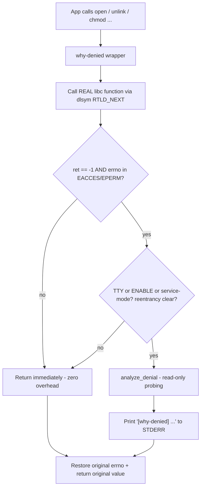
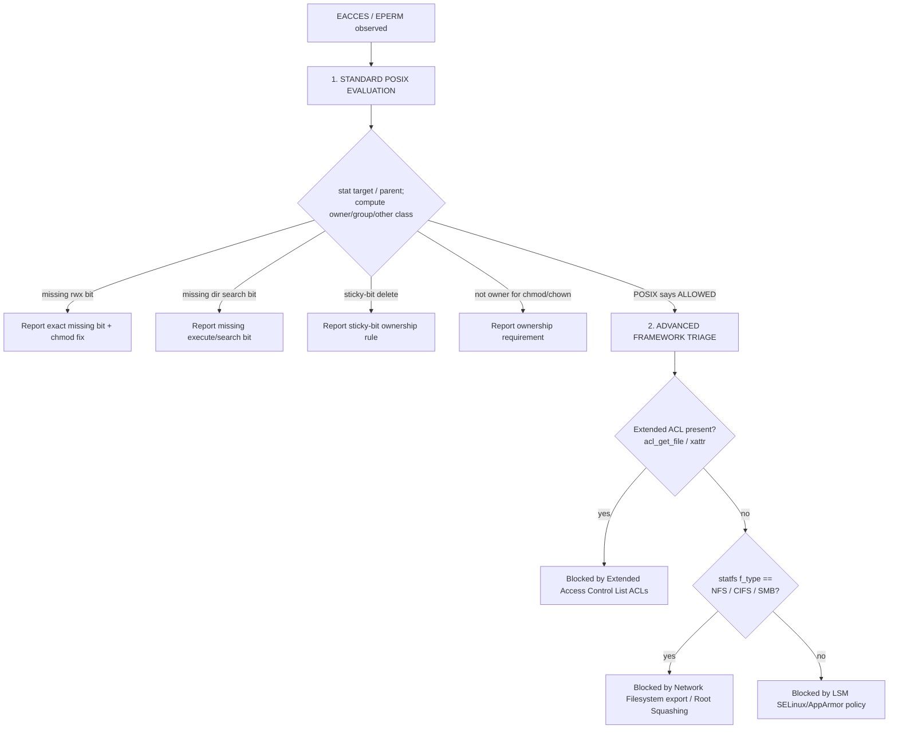

<div align="center">

# 🛡️ why-denied

### Stop guessing. Know *exactly* why your "Permission denied" happened

[](https://github.com/doper1/why-denied/releases)
[](LICENSE)
[](src/why-denied.c)

**`why-denied`** is a tiny helper that runs quietly in the background of your
shell. Whenever a command fails with the dreaded **"Permission denied"**, it
tells you **what actually went wrong** — and gives you the **exact command to
fix it**. No more guessing, no more digging through docs. Your programs keep
working exactly as before; you just get a friendly explanation when something
gets blocked.

</div>

---

## Table of Contents

- [What & Why](#what--why)
- [Quick demo](#quick-demo)
- [Architectural Overview](#architectural-overview)
- [The Triage Decision Tree](#the-triage-decision-tree)
- [POSIX Compliance Rationale](#posix-compliance-rationale)
- [Intercepted Syscalls](#intercepted-syscalls)
- [Installation](#installation)
- [Usage & Sample Output](#usage--sample-output)
- [CLI tool](#cli-tool)
- [Building from Source](#building-from-source)
- [Testing](#testing)
- [Packaging](#packaging)
- [Security Considerations](#security-considerations)
- [Performance Notes](#performance-notes)
- [Contributing](#contributing)
- [License](#license)

---

## What & Why

`Permission denied` is one of the least helpful error messages in computing. It
tells you *that* you were blocked, never *why*. Was it the file mode? A parent
directory you can't traverse? A POSIX ACL? An NFS root-squash? SELinux?

`why-denied` answers that question automatically. It hooks the libc wrappers
that can fail with `EACCES`/`EPERM`, and **only** when one of them actually does
(during an interactive session) it runs a careful, read-only investigation and
prints a one-line diagnosis to STDERR:

```text
$ touch /data/report.csv
touch: cannot touch '/data/report.csv': Permission denied
[why-denied] Cannot write into directory '/data': Missing group write permission. Run 'chmod g+w /data'.
```

The original program's behaviour, return value and `errno` are **never**
altered — `why-denied` is a passive observer that whispers the answer.

---

## Quick demo

| You run                       | The kernel says       | `why-denied` adds                                                                                          |
| ----------------------------- | --------------------- | ---------------------------------------------------------------------------------------------------------- |
| `cat /etc/shadow`             | `Permission denied`   | `[why-denied] Cannot READ from '/etc/shadow': Missing other read permission. Run 'chmod o+r /etc/shadow'.` |
| `./deploy.sh`                 | `Permission denied`   | `[why-denied] Cannot EXECUTE '/home/me/deploy.sh': Missing owner execute permission. Run 'chmod u+x ...'.` |
| `rm /tmp/someone-elses-file`  | `Operation not permitted` | `[why-denied] Cannot delete '/tmp/...': Directory '/tmp' has the sticky bit set; only the file's owner ...` |
| `echo x > /srv/share/file`    | `Permission denied`   | `[why-denied] Blocked by Network Filesystem (NFS) export rules or Root Squashing.`                         |

---

## Architectural Overview

`why-denied` is a shared object injected with `LD_PRELOAD`. Because preloaded
symbols take precedence over libc's, our wrappers run first; we then call the
*real* libc function (resolved with `dlsym(RTLD_NEXT, ...)`) and inspect the
result.



Three properties make this safe to leave loaded everywhere:

1. **Fail-safe pass-through.** The real call always executes first. Its return
   value and `errno` are exactly what the application sees. Every analysis path
   saves `errno` on entry and restores it on exit, and any internal failure
   (e.g. we can't `stat()` the parent) simply yields silence — never a behaviour
   change.

2. **TTY gating (with opt-in overrides).** By default the constructor engages
   only when `isatty(STDERR_FILENO)`. Set `WHY_DENIED_ENABLE=1` (or create
   `/etc/why-denied/service-mode` via `why-denied enable global`) to diagnose
   non-interactive workloads such as systemd units and cron jobs. Force silence
   with `WHY_DENIED_DISABLE=1`.

3. **Reentrancy guard.** A `__thread`-local flag prevents infinite recursion if
   any function we call during analysis is itself one of the intercepted
   wrappers. Combined with `write(2)`/`snprintf` (never buffered `stdio`) and
   stack-only buffers, the inspection path is reentrancy- and thread-safe.

---

## The Triage Decision Tree

When a call fails with `EACCES`/`EPERM`, `analyze_denial()` walks a deliberate
order: cheap, deterministic POSIX math first; expensive framework probes only as
a fallback when POSIX says the user *should* have been allowed.



This ordering matters: POSIX bits explain the overwhelming majority of real
denials and can be checked with a couple of `stat()` calls, so they go first.
Only when the arithmetic *clears* the user do we reach for the heavier,
distro-specific explanations.

---

## POSIX Compliance Rationale

The permission engine follows the classic POSIX algorithm exactly:

1. **Determine the applicable class once.** If the effective UID equals the
   file's owner → the **owner** class governs (even if the group/other bits are
   more permissive). Else if the effective GID or any supplementary group
   matches the file's group → the **group** class. Otherwise → **other**.
2. **Test only that class's bits.** POSIX does not "fall through" to a more
   permissive class. A file owned by you with mode `0044` is unreadable by you,
   and `why-denied` says so (`Missing owner read permission`).
3. **Creating or deleting a name requires write + execute on the parent
   directory**, not on the target — so those operations are diagnosed against
   the parent.
4. **The sticky bit (`S_ISVTX`)** on a directory restricts `unlink`/`rmdir` to
   the entry's owner, the directory's owner, or root — the `/tmp` rule.
5. **`chmod`/`chown` require ownership (or `CAP_FOWNER`)**, which is why they
   fail with `EPERM` rather than `EACCES` and are reported as ownership issues.

Supplementary groups are consulted via `getgroups(2)`, matching the kernel's own
check.

---

## Intercepted Syscalls

| Category              | Wrappers                                             | Access kind analysed                |
| --------------------- | ---------------------------------------------------- | ----------------------------------- |
| Read / Write / Create | `open`, `openat`, `creat`                            | READ or WRITE (CREATE into parent)  |
| Execution             | `execve`, `execveat`                                 | EXEC (+ `noexec` mount detection)   |
| Directory ops         | `mkdir`, `mkdirat`, `rmdir`, `unlink`, `unlinkat`    | CREATE / DELETE (+ sticky bit)      |
| Attributes            | `chmod`, `fchmod`, `fchmodat`, `chown`, `fchown`, `fchownat` | OWNERSHIP                    |

`open`/`openat` are handled as true variadic functions: the optional `mode_t`
is only consumed (via `va_arg`) when `O_CREAT`/`O_TMPFILE` is set. `*at()`
variants resolve dirfd-relative paths through `/proc/self/fd/<dirfd>`, and
`fchmod`/`fchown` resolve their target the same way.

---

## Installation

### From a prebuilt package

Replace `<version>` with the release you downloaded (e.g. the current
`version.txt`). Release assets are named by **format + libc + variant + arch**,
not per distro — because the compiled artifact is identical across distros that
share those axes. Pick the asset that matches your system:

| Asset | Serves |
| ----- | ------ |
| `why-denied_<version>_amd64-glibc.deb`        | Debian, Ubuntu, Mint, … (glibc, apt/dpkg) |
| `why-denied-<version>.x86_64-glibc.rpm`       | Fedora, Rocky, openSUSE, … (glibc, libacl) |
| `why-denied-<version>.x86_64-glibc-noacl.rpm` | RHEL/UBI (glibc, libacl-free xattr build) |
| `why-denied-<version>-musl.apk`               | Alpine (musl) |

```bash
# Debian / Ubuntu / Mint (.deb, glibc)
sudo apt install ./why-denied_<version>_amd64-glibc.deb
# or: sudo dpkg -i ./why-denied_<version>_amd64-glibc.deb

# Fedora / Rocky / openSUSE (.rpm, glibc, libacl) — dnf or zypper
sudo dnf install ./why-denied-<version>.x86_64-glibc.rpm
sudo zypper install ./why-denied-<version>.x86_64-glibc.rpm

# RHEL / UBI (.rpm, glibc) — libacl-free xattr build, no libacl dependency
sudo dnf install ./why-denied-<version>.x86_64-glibc-noacl.rpm

# Alpine (.apk, musl)
sudo apk add --allow-untrusted why-denied-<version>-musl.apk
```

> **Why one `.deb` and (mostly) one `.rpm`?** The single glibc `.deb` works on
> every Debian-family distro (they all ship `libacl1`), and the single glibc
> `.rpm` resolves on Fedora/Rocky/openSUSE alike — it depends on the
> `libacl.so.1` SONAME, which all of them PROVIDE despite naming the package
> differently (`libacl` vs `libacl5`). RHEL/UBI gets its own `-glibc-noacl`
> `.rpm` because that base ships no `libacl-devel`, so it is built libacl-free.

> **Arch Linux** ships a **source recipe**, not a prebuilt binary: each release
> attaches a `PKGBUILD`. Build + install it with `makepkg -si`, or just install
> from source (`make && sudo make install`). Arch's `acl` package already
> bundles the libacl headers and the `setfacl`/`getfacl` runtime, so no extra
> `-devel` package is needed.

> **From source on anything else:** each release also attaches a plain source
> tarball, `why-denied-<version>.tar.gz`.

Each package installs `why-denied.so` to `/usr/lib/why-denied/`, the
`/usr/bin/why-denied` CLI, and the activation hook to
`/etc/profile.d/why-denied.sh`. Open a new interactive shell and you're covered,
or use the CLI for ad-hoc runs and scoped enable/disable (see
[CLI tool](#cli-tool)). The
hook re-execs your interactive shell once with the preload already active, so the
shell instruments **itself** too — failed execs of your own scripts
(`./deploy.sh`) and your own redirections (`echo x > file`) are diagnosed, not
just the external commands the shell launches.

### Manual install from source

First install the build prerequisites (a C compiler, `make`, and the `libacl`
development headers):

```bash
# Debian / Ubuntu / Raspberry Pi OS
sudo apt install -y build-essential libacl1-dev

# RHEL / Rocky / Fedora
sudo dnf install -y gcc make libacl-devel

# openSUSE Leap / Tumbleweed
sudo zypper install -y gcc make libacl-devel

# Arch Linux (the `acl` package provides headers + setfacl)
sudo pacman -S --needed base-devel acl

# Alpine
sudo apk add build-base acl-dev
```

```bash
git clone https://github.com/doper1/why-denied.git
cd why-denied
make
sudo make install        # -> .so + /usr/bin/why-denied + /etc/profile.d hook
```

> **Arch Linux (no native package):** `make && sudo make install` is the
> supported path. The install lands `why-denied.so` in `/usr/lib/why-denied/`
> and the hook in `/etc/profile.d/why-denied.sh`, identical to the packaged
> distros. To build a real package, wrap this in a `PKGBUILD` (`make install
> DESTDIR="$pkgdir"`) and optionally publish it to the AUR.

> No `libacl` available? Build the dependency-free variant, which detects ACLs
> via the POSIX ACL xattr instead: `make HAVE_LIBACL=0 && sudo make install`.

### Ad-hoc, no install (single command or session)

```bash
# One command (manual):
LD_PRELOAD=./why-denied.so cat /etc/shadow

# Whole current shell:
export LD_PRELOAD="$PWD/why-denied.so"

# Equivalent via CLI:
WHY_DENIED_SO=./why-denied.so ./bin/why-denied run cat /etc/shadow
```

---

## Usage & Sample Output

Once activated, just use your shell normally. Below are representative messages
straight from the triage engine.

**Missing group write permission**

```text
[why-denied] Cannot WRITE to '/data': Missing group write permission. Run 'chmod g+w /data'.
```

**Missing owner read permission**

```text
[why-denied] Cannot READ from '/home/me/secret.txt': Missing owner read permission. Run 'chmod u+r /home/me/secret.txt'.
```

**Missing execute (search) permission on a parent directory**

```text
[why-denied] Cannot traverse path: Missing execute (search) permission on directory '/srv/private'. Run 'chmod o+x /srv/private'.
```

**Sticky-bit deletion**

```text
[why-denied] Cannot delete '/tmp/job.lock': Directory '/tmp' has the sticky bit set; only the file's owner (uid 1001) or root may delete it.
```

**Not the owner (chmod/chown)**

```text
[why-denied] Cannot change attributes of '/etc/hosts': You are not the owner (owned by uid 0). Only the owner or root may change permissions/ownership.
```

**Advanced fallbacks**

```text
[why-denied] Blocked by Extended Access Control List (ACLs). Inspect with 'getfacl /vault/data'.
[why-denied] Blocked by Network Filesystem (NFS) export rules or Root Squashing.
[why-denied] Blocked by Linux Security Module (SELinux/AppArmor) policy. Check 'dmesg' or 'audit2why'.
```

To temporarily silence it: `WHY_DENIED_DISABLE=1 <command>`.

---

## CLI tool

`why-denied` is a POSIX shell command (`/usr/bin/why-denied`) that wraps the
scattered `LD_PRELOAD` / env-var knobs into one reversible interface. The
default install still auto-activates interactive shells via `profile.d`; the CLI
is additive — use it to experiment, debug a single command, or temporarily widen
diagnostics to systemd units and cron jobs.

### Environment variables

| Variable | Set by | Effect |
| -------- | ------ | ------ |
| `LD_PRELOAD` | CLI / `profile.d` / manual | Loads `why-denied.so` at process start |
| `WHY_DENIED_ENABLE=1` | CLI `run` / `enable` | Engage on `EACCES`/`EPERM` even when STDERR is not a TTY |
| `WHY_DENIED_DISABLE=1` | CLI `disable` / manual | Force silence; wins over `WHY_DENIED_ENABLE` |
| `WHY_DENIED_SO` | dev / tests | Override path to the `.so` (default `/usr/lib/why-denied/why-denied.so`) |
| `WHY_DENIED_REEXEC` | `profile.d` / `shell` | Internal guard against re-exec loops |

### Command reference

```text
why-denied status              # report library path, scope, env overrides
why-denied run  [--] <cmd…>    # one-shot: preload + enable, then exec
why-denied try  <path>         # smoke-test: cat a path under preload
why-denied shell               # start a preloaded interactive login shell

why-denied enable  [scope]     # turn on (default scope: session)
why-denied disable [scope]     # turn off (default scope: session)
why-denied help                # usage summary (-h and --help also work)

man why-denied                 # full manual (after install)
```

**Scopes** for `enable` / `disable`:

| Scope | Privilege | What changes |
| ----- | --------- | ------------ |
| `session` (default) | user | prints `export`/`unset` lines for `eval` in your shell |
| `service` | root | writes/removes `/etc/systemd/system.conf.d/why-denied.conf` |
| `global` | root | touches/removes `/etc/why-denied/service-mode` marker |

Because a child process cannot modify its parent’s environment, **session scope
prints shell snippets** rather than mutating your shell directly:

```bash
eval "$(why-denied enable session)"
eval "$(why-denied disable session)"
```

### Usage examples

**Try a denial in the current terminal**

```bash
why-denied run cat /etc/shadow
why-denied try /etc/shadow          # shorthand for the above
```

**Debug a script once (works in pipes, cron, and journald via `WHY_DENIED_ENABLE`)**

```bash
why-denied run -- ./deploy.sh
```

**Start a preloaded shell (dev tree or no `profile.d`)**

```bash
WHY_DENIED_SO=./why-denied.so why-denied shell
```

**Inspect current state**

```bash
why-denied status
```

**Enable diagnostics for systemd services (troubleshooting window)**

```bash
sudo why-denied enable service
sudo systemctl daemon-reload
sudo systemctl restart myunit.service
journalctl -u myunit.service -f    # [why-denied] lines appear on STDERR

sudo why-denied disable service
sudo systemctl daemon-reload
```

**Cron**

```cron
0 2 * * * /usr/bin/why-denied run /usr/local/bin/backup.sh
```

Or set the env vars in the crontab:

```cron
WHY_DENIED_ENABLE=1
LD_PRELOAD=/usr/lib/why-denied/why-denied.so
0 2 * * * /usr/local/bin/backup.sh
```

**Per-unit drop-in (surgical alternative to `enable service`)**

```ini
[Service]
Environment=LD_PRELOAD=/usr/lib/why-denied/why-denied.so
Environment=WHY_DENIED_ENABLE=1
```

`enable service` writes the manager-level `DefaultEnvironment=…` drop-in so
every *restarted* unit inherits the preload. Prefer a per-unit drop-in when only
one service needs instrumentation.

### Install layout

```text
/usr/bin/why-denied                        # POSIX sh CLI
/usr/share/man/man1/why-denied.1           # manual page
/usr/lib/why-denied/why-denied.so          # shared library
/etc/profile.d/why-denied.sh               # interactive hook
/etc/why-denied/service-mode               # optional global non-TTY marker
/etc/systemd/system.conf.d/why-denied.conf # written by `enable service`
```

---

## Building from Source

Requirements: a C compiler (`gcc` or `clang`), `make`, and `libacl` headers
(`libacl1-dev` / `libacl-devel` / `acl-dev`).

```bash
make                 # builds why-denied.so (-O3 -Wall -Wextra -fPIC -shared)
make HAVE_LIBACL=0   # build without the libacl dependency (xattr fallback)
make test            # run test_denied.sh + test_cli.sh
make lint            # cppcheck
make format          # clang-format -i
make clean
```

The compile line is essentially:

```bash
cc -O3 -Wall -Wextra -fPIC -DHAVE_LIBACL=1 -shared \
   -o why-denied.so src/why-denied.c -ldl -lacl
```

---

## Testing

Two behavioural suites run under `make test`:

- `tests/test_denied.sh` — library triage branches and gating (`WHY_DENIED_ENABLE`,
  `WHY_DENIED_DISABLE`, non-TTY silence).
- `tests/test_cli.sh` — the `/usr/bin/why-denied` CLI (`run`, `try`, `enable` /
  `disable` scopes).

Because the default library gate engages on a TTY, most denial probes run inside
a pseudo-terminal (util-linux `script`, with a `python3` pty fallback). Probes
run as the **current, unprivileged** user — root bypasses POSIX checks — and
cases that must forge foreign ownership use passwordless `sudo` for *setup only*,
self-skipping with a clear message when a capability is missing.

### Quick start

```bash
make test            # build why-denied.so and run the suite on the host
```

The suite prints a `PASS / FAIL / SKIP` summary and exits non-zero on any FAIL.

### Coverage

| Triage branch | Case(s) | Privilege |
| ------------- | ------- | --------- |
| **Standard POSIX** | missing owner read; missing dir execute/search; missing owner write; parent not writable for create (`mkdir`); parent not writable for delete (`unlink`); missing execute bit for `execve`; create file in read-only dir; `rmdir` in read-only parent; deep-ancestor search denial | non-root |
| **Standard POSIX** | missing **group** write; **sticky-bit** unlink denial; **chmod** by non-owner; **other**-class read & search denials → carry the world-exposure warning | non-root probe, `sudo` setup |
| **ACL** | extended ACL (`setfacl`) denial despite permissive POSIX bits → `Blocked by Extended Access Control List (ACLs)` | non-root probe, `sudo` + `setfacl` setup |
| **Gating / safety** | silent on successful access (no false positives); `WHY_DENIED_DISABLE` escape hatch; silent when STDERR is not a TTY; `WHY_DENIED_ENABLE` override | non-root |

**Intentionally excluded from the automated suite / CI** (host-kernel & mount
dependent — they need a dedicated **enforcing VM**, not a container):

- **Mandatory Access Control** — SELinux/AppArmor (`Blocked by Linux Security Module …`).
- **Network filesystems** — NFS/CIFS/SMB root-squash (`Blocked by Network Filesystem …`).

### Docker matrix (local — mirrors CI exactly)

The same command CI runs (`make test`) is executed
across a glibc **and** musl distro matrix, as an unprivileged user with
passwordless sudo:

| Distro | `docker-test.sh` arg | libc | Package family |
| ------ | -------------------- | ---- | -------------- |
| Debian 12          | `debian`   | glibc | apt / `.deb` |
| Ubuntu 22.04 LTS   | `ubuntu`   | glibc | apt / `.deb` |
| Rocky Linux 9      | `rocky`    | glibc | dnf / `.rpm` |
| RHEL 9 (Red Hat UBI) | `rhel`   | glibc | dnf / `.rpm` (xattr ACL fallback — no `libacl-devel`) |
| Fedora 40          | `fedora`   | glibc | dnf / `.rpm` |
| openSUSE Leap 15   | `opensuse` | glibc | zypper / `.rpm` |
| Arch Linux         | `arch`     | glibc | pacman (no native package target) |
| Alpine             | `alpine`   | musl  | apk / `.apk` |

```bash
./docker-test.sh            # no arg -> debian only (fast, recommended locally)
./docker-test.sh debian     # Debian 12        (glibc, apt/.deb)
./docker-test.sh ubuntu     # Ubuntu 22.04 LTS (glibc, apt/.deb)
./docker-test.sh rocky      # Rocky 9          (glibc, dnf/.rpm)
./docker-test.sh rhel       # RHEL 9           (glibc, dnf/.rpm — Red Hat UBI; xattr ACL fallback)
./docker-test.sh fedora     # Fedora 40        (glibc, dnf/.rpm)
./docker-test.sh opensuse   # openSUSE Leap 15 (glibc, zypper/.rpm)
./docker-test.sh arch       # Arch Linux       (glibc, pacman)
./docker-test.sh alpine     # Alpine           (musl, apk/.apk)
./docker-test.sh all        # every distro above (slow cold build — CI sweep)
```

> **Run one distro locally; reserve `all` for CI.** With no argument the wrapper
> runs only `debian`, the fast representative. `all` cold-builds eight base
> images — openSUSE/Arch/Fedora are heavy and the first run can take **many
> minutes** (openSUSE alone ~1000s+ before the layer cache is warm). It exists
> for the CI matrix and deliberate full sweeps, not day-to-day iteration.
>
> **First-build slowness is expected**, and almost entirely one-time: Docker
> caches each image's base layer + the package-install layer, so re-runs against
> an unchanged Dockerfile reuse the cache and start in seconds. Editing a
> `docker/Dockerfile.*` invalidates that distro's layer and re-triggers its
> install. If builds are slow or get OOM-killed, raise Docker Desktop's CPU /
> memory allocation (Settings → Resources) — the compiles and package managers
> are the bottleneck.

Under the hood this is plain `docker compose`, so you can also drive services
directly:

```bash
docker compose run --rm test-debian
docker compose run --rm test-ubuntu
docker compose run --rm test-rocky
docker compose run --rm test-rhel
docker compose run --rm test-fedora
docker compose run --rm test-opensuse
docker compose run --rm test-arch
docker compose run --rm test-alpine
```

The repo is mounted read-only at `/src` and copied into a writable, tester-owned
`/work` tree at container start, so live edits are always reflected without
polluting the host checkout.

**Windows (Docker Desktop):** the commands above work unchanged from PowerShell
or Git Bash, e.g.:

```powershell
docker compose run --rm test-debian
bash docker-test.sh all
```

### Interactive manual testing

To poke at `why-denied` by hand (and watch the diagnostics appear live), drop
into an interactive shell in one of the test containers. The command below
builds the library and then `exec`s a **preloaded** shell, leaving you in a TTY
as the unprivileged `tester` user — exactly the conditions the shim needs to
engage:

```bash
docker compose run --rm test-debian bash -c "find /src -mindepth 1 -maxdepth 1 ! -name .git -exec cp -rf {} /work/ \; && make && LD_PRELOAD=/work/why-denied.so exec bash"
```

Now trigger a few denials — just run the commands normally:

```bash
# Missing owner read permission
echo secret > f; chmod 000 f; cat f

# Missing directory execute/search permission
mkdir d; echo hi > d/x; chmod 000 d; cat d/x; chmod 700 d

# Missing owner write permission
echo data > w; chmod 444 w; echo more > w

# Missing execute bit
cp /bin/true t; chmod 644 t; ./t

# Missing "other" permission (file owned by another user) — note the
# world-exposure warning, since 'chmod o+r' would open the file to everyone
sudo sh -c 'echo top > other.txt; chmod 0640 other.txt'; cat other.txt
```

Each command prints its normal error **plus** a `[why-denied] …` line naming the
root cause and the fix, e.g.:

```text
[why-denied] Cannot READ from 'f': Missing owner read permission. Run 'chmod u+r f'.
cat: f: Permission denied
```

When the denial falls on the **other** class, the suggestion is flagged because
widening it grants access to every user on the system:

```text
[why-denied] Cannot READ from 'other.txt': Missing other read permission. Run 'chmod o+r other.txt' (warning: grants read access to ALL users on the system).
cat: other.txt: Permission denied
```

To see the bare, unannotated behaviour for comparison, prefix a command with
`WHY_DENIED_DISABLE=1` (e.g. `WHY_DENIED_DISABLE=1 cat f`), or start a plain
shell without the preload.

> **Why preload the shell, not `export` inside it?** `LD_PRELOAD` is only read
> when a process starts, so a shell you export it into afterwards is itself
> uninstrumented — it would still catch external commands like `cat`, but miss
> the redirections it performs (`echo > w`) and failed execs of its own children
> (`./t`). Launching the shell with the preload (as above) instruments the shell
> itself. This is exactly how the real `profile.d` install behaves: it exports
> `LD_PRELOAD` and then re-execs the interactive shell once (guarded against
> looping), so every interactive shell ends up genuinely preloaded — including
> for its own execs and redirections.
>
> The shim also stays silent unless STDERR is a TTY and the user is non-root, so
> redirecting stderr to a file or running as root shows no `[why-denied]` output
> — by design. Swap `test-debian` for any other service (`test-ubuntu`,
> `test-rocky`, `test-rhel`, `test-fedora`, `test-opensuse`, `test-arch`,
> `test-alpine`) to try the other libc/distro families.

### Local ⇄ CI parity

`.github/workflows/ci.yml` keeps the existing **lint** (`clang-format` +
`cppcheck`) and **build** (`gcc`/`clang`) jobs, and runs the **test** job as a
`debian`/`ubuntu`/`rocky`/`rhel`/`fedora`/`opensuse`/`arch`/`alpine` matrix that
invokes `bash docker-test.sh <distro>` — the identical entrypoint you use
locally. A non-zero exit from `tests/test_denied.sh` fails the job.
`acl`/`setfacl` is installed in every image so the ACL path is exercised in CI
as well.

> musl note: on Alpine, `-ldl` is satisfied by musl's libc, `script` ships in
> the `util-linux-misc` subpackage (with `python3` as a pty fallback), and the
> suite uses `bash` explicitly.
>
> RHEL note: Red Hat's UBI repos don't ship `libacl-devel`, so the RHEL image
> builds with `HAVE_LIBACL=0` — the libacl-free variant that detects ACLs via
> the POSIX ACL xattr. This is the one image that exercises that fallback path,
> while `acl`/`setfacl` is still present so the ACL case runs rather than skips.

---

## Packaging

`packager.sh` uses [`fpm`](https://github.com/jordansissel/fpm) to emit native
packages from a staging tree:

```bash
gem install fpm          # one-time
./packager.sh all        # build .deb, .rpm and .apk into ./dist/
./packager.sh deb        # or a single format
```

The release is organised around the axes that actually change the artifact —
**package format + libc + libacl variant + arch** — rather than one build per
distro, because the compiled `why-denied.so` is identical across distros that
share those axes. The 8-distro test matrix therefore collapses to a small set of
real artifacts:

| Artifact | Built in | libc | Variant | Serves |
| -------- | -------- | ---- | ------- | ------ |
| `…-glibc.deb`        | `debian:12`                       | glibc | libacl | Debian, Ubuntu, Mint, … |
| `…-glibc.rpm`        | `quay.io/rockylinux/rockylinux:9` | glibc | libacl | Fedora, Rocky, openSUSE, … |
| `…-glibc-noacl.rpm`  | `ubi9/ubi:9.6`                    | glibc | **`HAVE_LIBACL=0`** | RHEL/UBI (no `libacl-devel`) |
| `…-musl.apk`         | `alpine:3.20`                     | musl  | libacl | Alpine |
| `PKGBUILD`           | host (`make pkgbuild`)            | —     | source | Arch (`makepkg -si`) |
| `…-<version>.tar.gz` | host (`make tarball`)             | —     | source | from-source on anything |

Why this shape:

- **One glibc `.deb`** serves the whole Debian family (all ship `libacl1`).
- **One glibc libacl `.rpm`** serves Fedora/Rocky/openSUSE: it depends on the
  `libacl.so.1()(64bit)` SONAME capability, which every RPM family PROVIDES even
  though they name the package differently (`libacl` vs `libacl5`).
- **A second, libacl-free `.rpm`** exists only for RHEL/UBI, whose base ships no
  `libacl-devel`; `docker/Dockerfile.rhel` builds it `HAVE_LIBACL=0`, so the
  release mirrors that and drops the libacl dependency entirely.
- **musl gets its own `.apk`** — a musl binary is not interchangeable with the
  glibc ones. It is built via `docker run alpine:3.20` on a glibc host because
  GitHub's bundled Node20 cannot run JS actions inside a musl container.
- **Arch ships a source `PKGBUILD`**, not a binary: `fpm` has no pacman output
  target, so `makepkg` compiles from the released tarball on the user's machine.
- Filenames encode format+libc+variant+arch, so artifacts never collide when the
  publish job flattens them. Builds target **x86_64** (the hosted runner arch);
  add an arch axis to the matrix to ship more.

A separate non-container job downloads every artifact and attaches them all to
the GitHub Release in one step.

---

## Security Considerations

- **`LD_PRELOAD` is ignored for setuid/setgid binaries** by the dynamic loader,
  so `why-denied` cannot be used to influence privileged programs — by design we
  never ship or rely on any setuid component.
- **Interactive-only by default.** The `/etc/profile.d` hook activates the shim
  only when `[ -t 1 ]` (a terminal), and the library engages on a TTY unless
  explicitly opted in via `WHY_DENIED_ENABLE`, `why-denied enable global`, or
  `why-denied enable service`. Disable service/global scopes after debugging —
  non-TTY diagnostics can add noise to journald and cron mail.
- **Read-only and fail-safe.** The analysis path performs only `stat`/`statfs`/
  `getgroups`/`readlink`/ACL reads. It cannot modify files and cannot change the
  observed `errno` or return value. Any internal error degrades to silence.
- **No buffered I/O in the hot path.** Output uses `write(2)` on stack buffers,
  avoiding `stdio` locks and heap allocation, which keeps it safe under
  reentrancy and in multi-threaded programs.
- **Trust boundary.** As with any `LD_PRELOAD` library, only install
  `why-denied.so` from a trusted source into a root-owned path
  (`/usr/lib/why-denied/`).

---

## Performance Notes

On the success path the entire cost is: the real syscall, plus one predicted-
not-taken branch (`!g_disabled && ret == -1`). There are **no** extra syscalls,
**no** allocations and **no** I/O when a call succeeds. In non-interactive
sessions the global disabled flag short-circuits everything. The expensive work
(a handful of `stat()`s, an optional `statfs()`/ACL read) happens exclusively on
the cold error path, where a human is already waiting to read the message.

---

## Contributing

Contributions are welcome! This project uses
[**Conventional Commits**](https://www.conventionalcommits.org/) so that
[release-please](https://github.com/googleapis/release-please) can automate
versioning and the changelog:

```text
feat: detect noexec mount on execve failures
fix: preserve errno across statfs probe
docs: clarify sticky-bit semantics
```

Please run `make format && make lint && make test` before opening a PR. The CI
pipeline enforces `clang-format --dry-run -Werror` and `cppcheck`.

---

## License

[MIT](LICENSE) © 2026 why-denied contributors.
